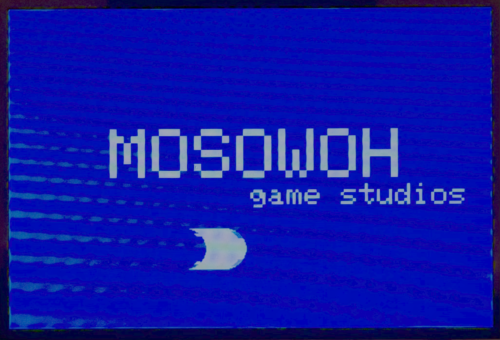
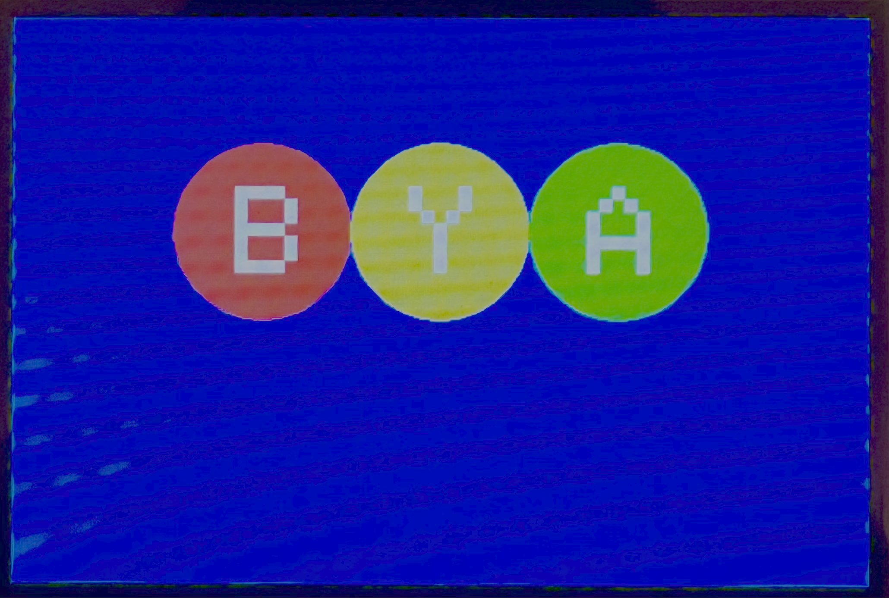
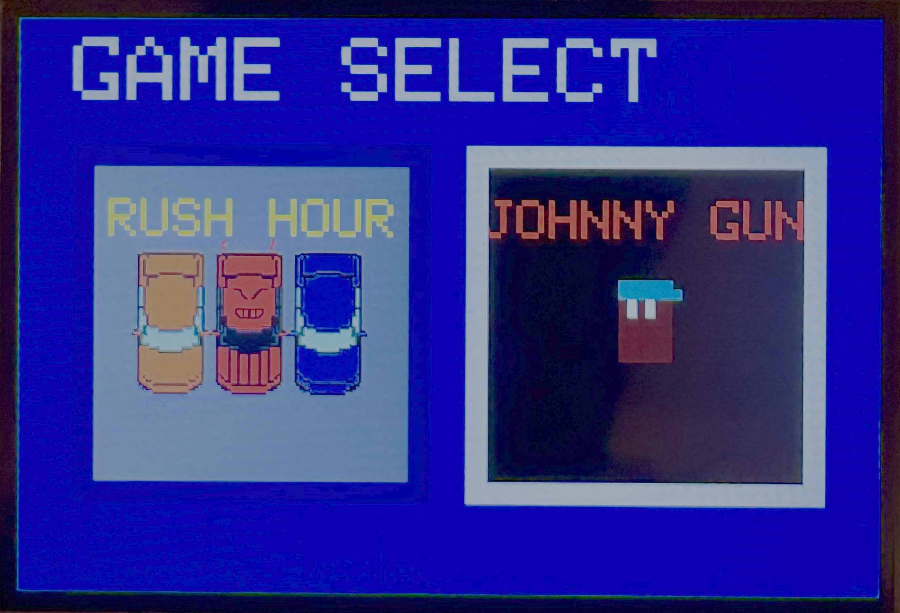
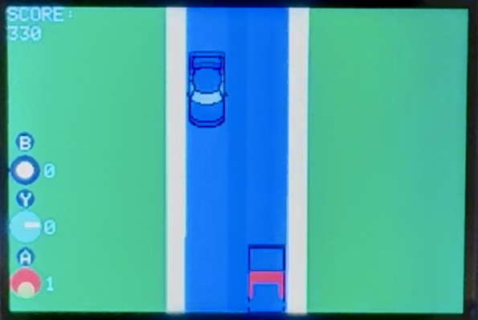
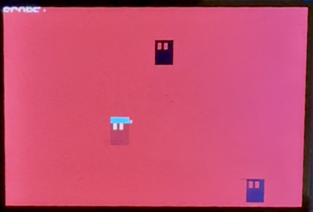

# 🔴🟡🟢 The BYA Machine

<div align="center">

<p><em>MOSOWOH game studios presents...</em></p>
</div>
A fully-featured retro gaming console built on Arduino/ESP32 with C/C++.
<div align="center">

<p><em>The BYA Machine.</em></p>
</div>

## What MOSOWOH Does

A **handheld gaming console** featuring **2 complete arcade games** with progression systems:

- **Rush Hour** - Car racing with 9 levels and power-ups
- **Johnny Gun** - Side-scrolling shooter with environmental effects  
- **High Scores** - Persistent leaderboards

## Games Overview
<div align="center">

<p><em>Game selection screen.</em></p>
</div>

### 🚘 Rush Hour
Navigate through increasingly challenging traffic while collecting power-ups and avoiding collisions.

**Features:**
- 9 progressive difficulty levels
- 4 unique power-ups: Point Multiplier, Invincibility, Slow Time, Flame Barrier
- Shop system with upgradeable power-ups
- Car customization with 21 colors + window tints
- Dynamic level layouts and enemy patterns

<div align="center">

<p><em>Rush Hour: Dodge traffic and collect power-ups</em></p>
</div>

### 💥 Johnny Gun  
Classic side-scrolling shooter with environmental effects and progressive difficulty.

**Features:**
- 8-directional player movement
- Single-bullet shooting mechanics
- Dynamic enemy spawning patterns
- Environmental changes: Lights Out mode (500+ points), Blood Moon (1000+ points)
- Escalating difficulty with increasing enemy counts

<div align="center">

<p><em>Johnny Gun: Survive waves of enemies</em></p>
</div>

## Hardware Requirements

- **ESP32 or Arduino-compatible board**
- **TFT Display** (320x240 recommended)
- **Analog Joystick** (2-axis)
- **Push Buttons** (2 minimum: A/Select, B/Back)
- **Buzzer/Speaker** for audio effects

## Setup

1. **Install Arduino IDE**
   ```bash
   # Install TFT_eSPI library via Library Manager
   ```

2. **Configure Hardware Pins**
   ```cpp
   // Default pin configuration in GameConstants.h
   #define JOYSTICK_X_PIN A14
   #define JOYSTICK_Y_PIN A15  
   #define BUTTON_1 8          // A/Select button
   #define BUTTON_2 9          // B/Back button
   ```

3. **Upload to Board**
   - Open `main.ino` in Arduino IDE
   - Select your board type and port
   - Click Upload

## Controls

```
Joystick     → Navigate menus / Move player
Button A     → Select menu item / Shoot (Johnny Gun)
Button B     → Go back / Return to menu
```

### Code Structure
```
src/
├── GameSystem.h/cpp      → Hardware abstraction layer
├── GameState.h/cpp       → Screen and state management  
├── UIComponents.h/cpp    → Reusable interface elements
├── RushHour.h/cpp        → Complete Rush Hour game
├── JohnnyGun.h/cpp       → Complete Johnny Gun game
├── GameConstants.h       → All constants and definitions
└── sprites.h             → Sprite and graphics data
```

## Built With

- **Arduino/ESP32** - Microcontroller platform
- **TFT_eSPI** - High-performance display library
- **C++** - Core programming language  
- **Clean Code Principles** - SOLID, DRY, modular architecture

</div>

---

*MOSOWOH... the future of gaming (if it was released 50 years ago)*
